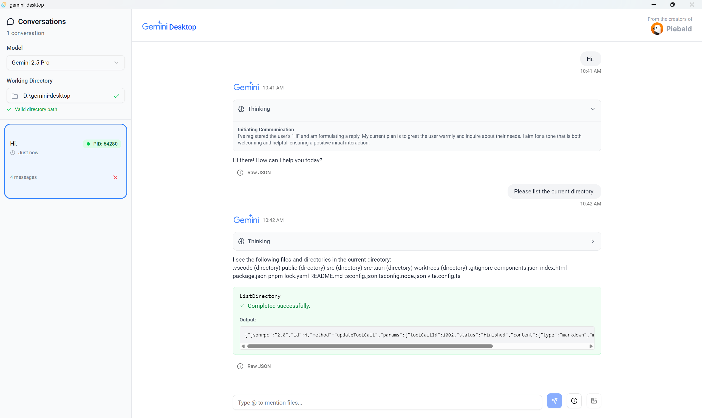

# Gemini Desktop

A powerful, modern desktop UI for Gemini CLI.  Built with Tauri and web technologies.  Cross-platform, open-source on [GitHub.](https://github.com/Piebald-AI/gemini-desktop)



## How it works

Gemini CLI can function as an ACP (Agent Communication Protocol) server, which enables real-time communication via JSON RPC 2.0 between the client, Gemini Desktop, and the server, Gemini CLI.

## Building

```
git clone https://github.com/Piebald-AI/gemini-desktop
cd gemini-desktop
pnpm install
pnpm tauri dev
```

## Contributing

Contributions are welcome, although it's a bit raw still.

## License

[MIT](./LICENSE)

Copyright © 2025 [Piebald LLC.](https://piebald.ai)
